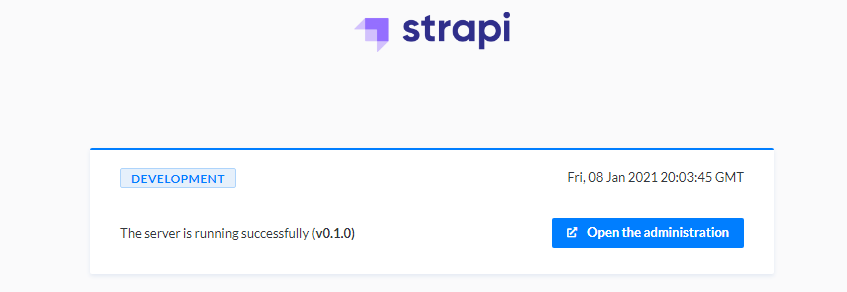
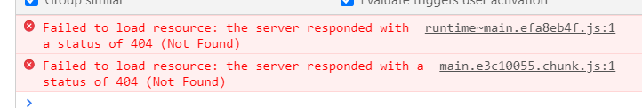

# Setting up a Strapi with Docker using Nginx reverse proxy (with Plesk)

## Goal
I want to have Strapi CMS installed on my VPS that is running with Plesk. I want to use Strapi container and the connection to the admin panel has to be secured (https) so I can not access it on the default port that is generated by docker but I have to use nginx to reverse proxy it. 

Go to Plesk Docker dashboard and download + start Strapi container. For sake of this note lets assume that my domain is `www.tralalala.com` and the Docker exposes the Strapi app on `www.hudlilili.secret.net:32584`.

I wanted my Strapi to run on `www.tralalala.com/strapi` so I followed this tutorial <https://strapi.io/documentation/developer-docs/latest/deployment/nginx-proxy.html> and it just did not work. I was able to access `www.tralalala.com/strapi` (showing welcome page and everything) but as I tried to go to the admin login (clicked the *open the administration*) it only showed white page (errors listed+ image bellow). There is like a ton of github issues with the same problem. I tried to follow the solutions but I was not able to get it up and running.



```
runtime~main.efa8eb4f.js:1 Failed to load resource: the server responded with a status of 404 (Not Found)
main.e3c10055.chunk.js:1 Failed to load resource: the server responded with a status of 404 (Not Found)
```



I found a stackoverflow question where it was solved creating a separate subdomain. So I did that, created `www.strapi.tralalala.com` and it works!